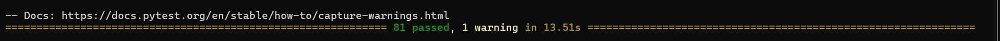
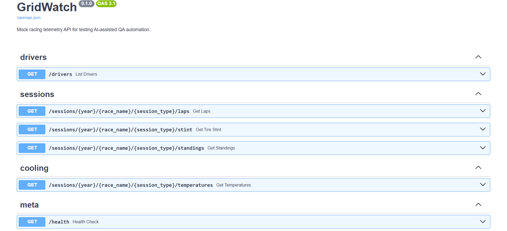
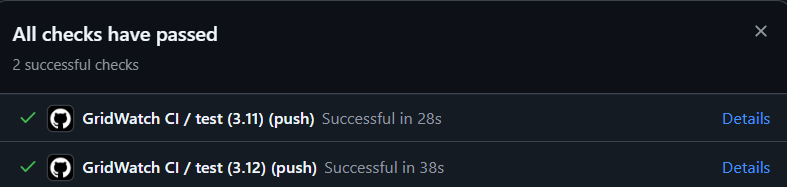
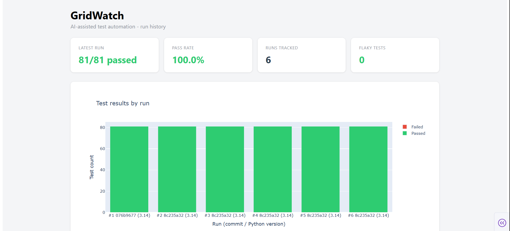
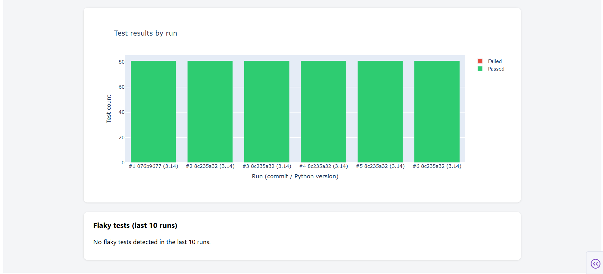

# GridWatch

An AI-assisted test automation framework built around a mock racing telemetry API — laps, tire stints, driver standings, and component temperature/cooling data — with a full CI/CD pipeline and a Postgres-backed test history dashboard.



## The problem

Backend services need continuous, automated test coverage, but hand-writing every test doesn't scale. Teams are increasingly using AI to help *generate* tests — which raises a real question: **how do you know an AI-generated test is actually good, and not just plausible-looking code that tests nothing?**

## The solution

GridWatch has two halves:

1. **A realistic mock racing API** (FastAPI) with laps, tire stints, driver standings, and a threshold-based cooling/temperature system (brakes, engine, ERS) — something with enough real business logic to be worth testing properly.
2. **A QA automation layer on top of it**:
   - An OOP test framework (`qa_framework/client.py`) so tests read like plain English, not raw HTTP calls.
   - **AI-assisted test generation** — an LLM proposes new edge-case tests.
   - **A validation layer** (`qa_framework/test_reviewer.py`) that checks AI-generated tests for correctness (valid syntax, real assertions, not trivially-true), consistency (follows this repo's conventions), and usefulness (not a duplicate) — before anything is trusted enough to merge. Nothing auto-merges; every AI suggestion is written to disk for human review.
   - A GitHub Actions CI pipeline running the full suite across two Python versions on every push.
   - A Postgres (Neon) backed test history store, with flaky-test detection (tests whose outcome changed across recent runs with no code change).
   - A Dash dashboard visualizing pass/fail trends and flaky tests over time.

## Tech stack

- **API**: Python, FastAPI, Pydantic
- **Testing**: pytest, boundary value testing, mocked/deterministic test data (no live network dependency in CI)
- **AI integration**: Anthropic API (Claude) for test generation, with a custom validation layer for evaluating AI output
- **Database**: PostgreSQL (Neon), SQLAlchemy
- **CI/CD**: GitHub Actions (multi-version test matrix, JUnit XML reporting)
- **Dashboard**: Plotly Dash

## Screenshots

**API documentation (Swagger UI)**


**Cooling/temperature endpoint — threshold-based status**


**CI pipeline passing on every push**


**Test history dashboard**



## Project structure

```
gridwatch/
├── app/                    # The mock racing API
│   ├── main.py
│   ├── models.py            # Pydantic data contracts
│   ├── mock_data.py          # Deterministic race data generator
│   ├── validation.py         # Shared input validation
│   ├── cooling.py            # Threshold-based temperature status engine
│   └── routers/
│       ├── drivers.py
│       ├── sessions.py       # Laps, stints, standings
│       └── cooling.py        # Component temperature endpoint
├── qa_framework/            # The test automation framework
│   ├── client.py              # Service Object API client
│   ├── ai_test_generator.py   # Calls Claude to propose new tests
│   ├── test_reviewer.py       # Validates AI-generated tests before trusting them
│   ├── junit_parser.py        # Parses pytest's JUnit XML output
│   └── test_history.py        # Postgres-backed run history + flaky test detection
├── tests/                    # 81 tests covering the API and the framework itself
├── scripts/
│   ├── generate_and_review_tests.py   # End-to-end AI test generation workflow
│   ├── record_test_run.py             # Records a pytest run into the history DB
│   └── clear_test_history.py          # Resets recorded history
├── dashboard/
│   └── app.py                # Test history dashboard (Dash)
└── .github/workflows/ci.yml  # CI pipeline
```

## Running it

```bash
# API
pip install -r requirements.txt
uvicorn app.main:app --reload
# -> http://localhost:8000/docs

# Tests
pip install -r requirements-dev.txt
pytest -v

# AI-assisted test generation (needs ANTHROPIC_API_KEY)
python scripts/generate_and_review_tests.py "the stint endpoint's edge cases"

# Test history + dashboard (needs DATABASE_URL, a Postgres connection string)
pip install -r requirements-dashboard.txt
pytest -v --junitxml=test-results.xml
python scripts/record_test_run.py test-results.xml
python dashboard/app.py
# -> http://localhost:8050
```

## What this demonstrates

- Building automated test suites and reusable test frameworks (not one-off scripts)
- API testing, including negative/edge cases and boundary value analysis
- Object-oriented design (Service Object pattern, a class-based threshold evaluator)
- CI/CD pipelines and automated test reporting
- Working with a relational database
- **Evaluating AI-generated output for correctness, consistency, and practical usefulness** — rather than assuming AI output is automatically trustworthy
